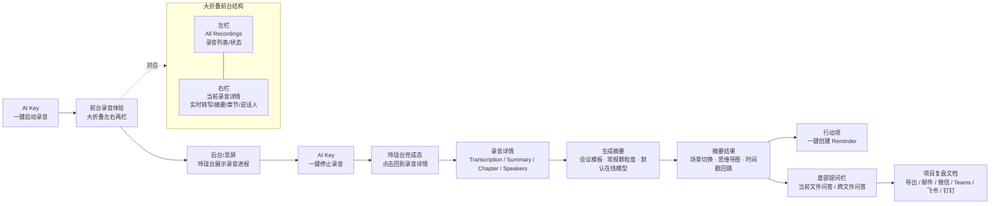

# AI Recorder UX Flow Review



## Screen Sketch

```text
┌────────────────────────────────────────────────────────────────────────────┐
│ 大折叠展开态                                                               │
├───────────────────────────────┬────────────────────────────────────────────┤
│ 左栏 All Recordings            │ 右栏 当前录音详情                         │
│                               │                                            │
│ ☰                         ⌕   │ ←  自动转写中   AI 模型在线        ✎ ✦ ⋮  │
│                               │                                            │
│ All                           │ In Conversation with Daniel Leyser          │
│ Recordings                    │ MetaDesign is Red Dot                       │
│                               │ 00:19 · Dec 01                              │
│ ● In Conversation...          │                                            │
│   00:19 · Dec 01              │ 录音中 / 会议模式 / 实时转写 / 后台可继续  │
│   Transcribe                  │ 当前摘要 / 待办 / 问答 / 分享              │
│                               │ 远场拾音 / 低功耗 / 多语言 / 摘要 / 问答    │
│ ● In Conversation...          │                                            │
│   Transcribing...             │ [Transcription][Summary][Chapter][Speakers] │
│                               │                                            │
│ ● In Conversation...          │ ┌────────────────────────────────────────┐ │
│   Transcribed                 │ │ Summary                                │ │
│                               │ │ 内容总结                               │ │
│                               │ │ 智能处理                               │ │
│                               │ │ 模板选择：推荐/自定义/会议/教育/旅行   │ │
│                               │ │ 会议内容                               │ │
│                               │ │ 待办事项  [+ 添加到 Reminder]          │ │
│                               │ │ 系统联动 / 多端知识库                  │ │
│                               │ └────────────────────────────────────────┘ │
│                               │                                            │
│                               │ 00:24        [暂停]        [■ 停止]         │
└───────────────────────────────┴────────────────────────────────────────────┘

后台/息屏：
┌──────────────────────────────┐
│ 玲珑台                        │
│ ● AI Recorder 正在录音 00:24  │
│   实时转写中 · 会议进行中       │
└──────────────────────────────┘

停止后：
┌──────────────────────────────┐
│ 玲珑台完成态                  │
│ ✓ 录音已保存                  │
│   点击查看摘要和待办           │
└──────────────────────────────┘
```
*** End Patch
 
